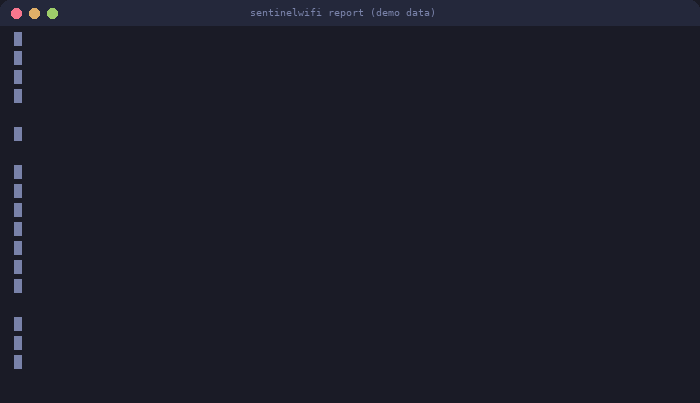
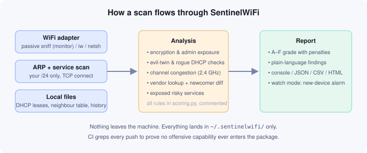

<h1 align="center">SentinelWiFi</h1>

<p align="center">
  <strong>A home network health check for your own WiFi and LAN.</strong><br>
  Grades your network A–F, flags what's wrong, and tells you how to fix it — in plain language.
</p>

<p align="center">
  
  
  
  
</p>

<p align="center">
  
</p>

SentinelWiFi audits the network **you own**: WiFi encryption, router admin
exposure, rogue DHCP servers, evil-twin access points, and the devices on
your subnet. Everything is passive and local-only — it listens, never
transmits anything beyond ordinary LAN traffic, writes its data to
`~/.sentinelwifi/`, and has no telemetry, no cloud component, and no
auto-update.

> **Scope:** run this on networks you own or are explicitly authorized to
> test. Scanning or monitoring other people's networks is illegal in most
> jurisdictions (CFAA in the US, computer-misuse laws in the EU, and
> equivalents elsewhere).

| | Linux | Windows | macOS |
|---|---|---|---|
| Connection audit | ✔ | ✔ (via netsh) | ✔ |
| AP environment scan | ✔ full / managed fallback | managed only | unsupported |
| Evil-twin + congestion analysis | ✔ | ✔ | unsupported |
| Device inventory (`devices`, `watch`) | ✔ | ✔ | unsupported |
| Service scan (`ports`) | ✔ | ✔ | unsupported |
| Passive sniffing window | ✔ monitor adapter | — | — |

macOS is **unsupported**: it may work, but nobody has verified it. If you
try it, run `sentinelwifi doctor` and file an issue with the output.

## Quick start

```bash
pipx install git+https://github.com/navairgap/SentinelWiFi.git

sentinelwifi doctor       # check your environment (2 seconds)
sudo sentinelwifi report  # the full audit of your network
```

Or from a clone:

```bash
git clone https://github.com/navairgap/SentinelWiFi.git
cd SentinelWiFi
pip install -r requirements.txt
python sentinel.py selftest
sudo python sentinel.py report
```

No adapter handy, or just curious what the output looks like?
`python sentinel.py demo` renders a full report from synthetic data —
that's exactly what the GIF above shows.

## What it checks

- 📶 **Your connection** — SSID, BSSID, channel, signal, and encryption
  type. Open and WEP networks are flagged as what they are: no real
  protection.
- 🔐 **Router admin exposure** — whether the admin page answers on HTTP
  (your admin password crosses the LAN in cleartext) or HTTPS.
- 🚨 **Rogue DHCP** — parses your own DHCP lease files. If the server that
  handed out your settings isn't your gateway, someone else may be
  redirecting your traffic.
- 👥 **Evil twins** — if your SSID is broadcast by more than one access
  point, you get a critical warning with the suspicious BSSIDs listed.
- 📡 **Channel congestion** — how many networks share your channel, with
  2.4 GHz overlap math (channels 1/6/11 are not the whole story).
- 🔓 **WPS detection** — if WiFi Protected Setup is enabled, your network
  can be cracked via its PIN no matter how strong your password is.
  Detected passively from beacons; the fix is a single router toggle.
- 🛡️ **Deauth resistance check** — reads the PMF (802.11w) flag to tell you
  whether forced-disconnect attacks would even work against your network.
  No attack is ever performed; it's a capability flag in the beacon.
- 📡 **WiFi generation** — WiFi 4 / 5 / 6 / 7 detected from the beacon,
  so you know when your router is due for an upgrade.
- 🖥️ **Devices on your LAN** — ARP scan of your /24 with vendor lookup.
  Devices are remembered between runs; anything new shows up marked
  ★ NEW. `watch` re-sweeps every 60 s and alerts on joiners, optionally
  with a desktop notification.
- 🚪 **Exposed services** — a fast TCP connect-scan of a small curated
  port list (Telnet, TR-069, VNC, RDP, SMB…) against your own devices,
  with banner grabbing: *"what could an attacker who got onto my WiFi
  touch first?"*

## How it works



## What it deliberately does not do

No packet injection, no deauthentication, no handshake capture, no
password or WPS attacks, no association attempts, no scanning outside
your subnet. CI enforces this: every push greps the package for offensive
capability and fails the build if any appears. That's not a marketing
line — it's a test in [ci.yml](.github/workflows/ci.yml), and you can run
it yourself:

```bash
grep -ri "deauth\|inject\|handshake\|crack" sentinelwifi/   # returns nothing
```

If a feature needs monitor mode and your adapter can't do it, the tool
falls back to a managed-mode scan and says so in the report. It never
crashes, and it never silently skips.

## Commands

```
scan      your WiFi + surroundings (+ grade)
devices   device inventory, newcomers flagged (--csv for scripts)
ports     exposed-service scan of your subnet
watch     loop the inventory, announce new devices
report    everything, one report (--html for a standalone file)
selftest  environment checklist (doctor is an alias)
demo      report from synthetic data
```

Global flags work before or after the subcommand: `--json`, `--html FILE`,
`--iface NAME`, `--quiet` (suppresses platform notes — handy in cron).
Per-command options: `--window`, `--interval`, `--timeout`, `--no-ports`,
`--notify`, `--csv`.

Machine-readable output is first-class: `--json` for full reports,
`--csv` for device lists, `--quiet` for clean logs. Example cron entry
that appends only new devices to a file:

```cron
*/15 * * * * cd /opt/SentinelWiFi && python3 sentinel.py devices --csv --quiet >> /var/log/lan-devices.csv 2>/dev/null
```

## Sample outputs

- Full console report (text): [docs/sample-report.txt](docs/sample-report.txt)
- Same report as a standalone HTML page: [docs/sample-report.html](docs/sample-report.html)
- Static terminal screenshot: [docs/sample-report.svg](docs/sample-report.svg)

## Configuration

On first run a config file appears at `~/.sentinelwifi/config.json`:

```json
{
  "watch_interval": 60,
  "port_scan_timeout": 0.5,
  "port_scan_enabled": true,
  "notify": false,
  "trusted_bssids": [],
  "preferred_iface": ""
}
```

`trusted_bssids` is worth setting on dual-band setups: put your own
APs' BSSIDs there and the evil-twin check stops flagging your second
radio.

## How the grade works

The score starts at 100 and loses points per finding — Open/WEP WiFi
(−45), rogue DHCP (−20), a possible evil twin (−20), unknown devices
(−10/−25), HTTP admin page (−15), exposed risky services (−10), a
brand-revealing SSID (−10), WPS enabled (−10), PMF off (−5), congestion
(−5), WPA2 instead of WPA3 (−5).
Bands: A ≥ 90, B ≥ 75, C ≥ 60, D ≥ 40, F below that. Every rule lives in
`scoring.py`, commented, in plain sight.

## Platform notes

- **Linux** is the primary target. Passive sniffing wants a
  monitor-capable adapter (most laptop built-ins are managed-mode-only;
  the tool detects this and falls back). Install `iw` for wireless tools.
- **Windows** works for everything except monitor mode.
- **macOS** is unsupported — it may work, but it has never been run
  there. If you try it, `doctor` first, then file an issue with the
  output.
- Missing `scapy`? ARP falls back to reading the kernel neighbour table
  (after priming it with a quick connect sweep) and sniffing is skipped
  with a note. Missing `rich`? Plain text instead of colors.
- If you installed scapy with `pip install --user`, run without `sudo`
  or install it system-wide — root's Python can't see user packages.

## FAQ

**Is it safe to run on public WiFi?**
Yes — that's a design goal. It never injects frames, never attempts to
join anything, and stores everything locally. It adds no attack surface
of its own.

**Why does the report say "no devices found" when I ran with sudo?**
You probably installed scapy with `pip install --user`, which root's
Python can't see. Either run without sudo, or `sudo pip install scapy`.
`sentinelwifi doctor` will tell you exactly which case you're in.

**My router has two WiFi names (2.4 GHz and 5 GHz) — why is it flagged
as a possible evil twin?**
Two BSSIDs with the same SSID is exactly what a dual-band router looks
like. Add both BSSIDs to `trusted_bssids` in the config and the warning
stops.

**Does the "new device" alarm mean someone hacked me?**
No — it means a device your machine hasn't seen before joined your
network. A housemate's new phone triggers it too. That's the point: you
decide whether you recognize it.

**The grade dropped after I changed nothing — why?**
New neighbors, a new device, or your router answering HTTP after a
firmware update all change findings. Run it a few times to learn your
network's normal baseline.

## Development

```bash
python -m unittest discover -s tests   # 34 tests, no network required
```

Contributions welcome — see [CONTRIBUTING.md](CONTRIBUTING.md). The two CI
guards that keep the tool honest (no offensive capability, header on every
file) are non-negotiable. Planned work is in [ROADMAP.md](ROADMAP.md);
changes are logged in [CHANGELOG.md](CHANGELOG.md).

## License

MIT, see [LICENSE](LICENSE). Use it on your own networks.
