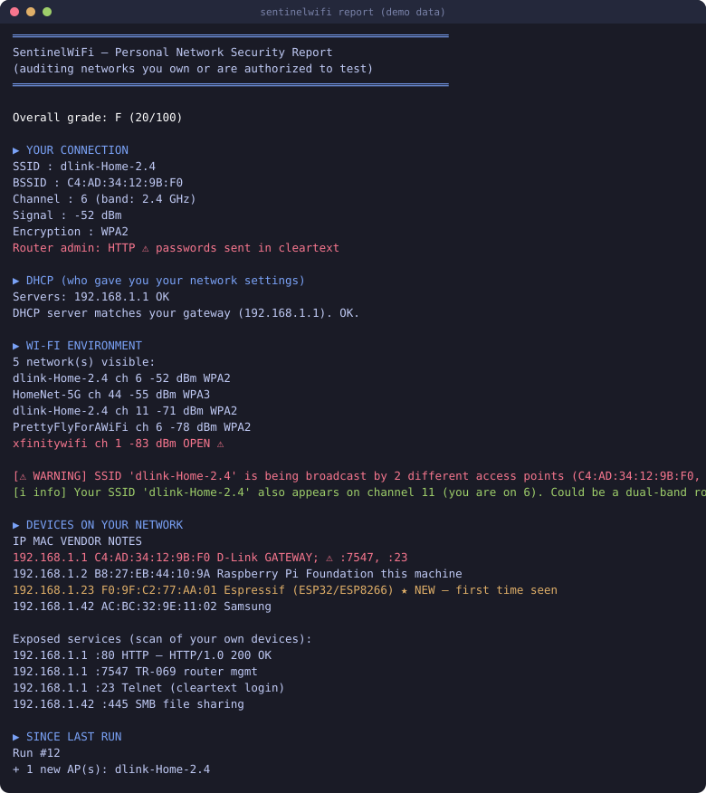

# SentinelWiFi

A home network health check for your own WiFi and LAN. SentinelWiFi
audits the security of the network you own — encryption, router admin
exposure, rogue DHCP, evil-twin access points, and the devices on your
subnet — then grades it A–F and tells you, in plain language, how to fix
what it finds.

It is not a penetration-testing tool and doesn't try to be. It listens,
never transmits anything beyond ordinary LAN traffic, writes its data to
`~/.sentinelwifi/`, and has no telemetry, no cloud component, and no
auto-update.



| | Linux | Windows | macOS |
|---|---|---|---|
| Connection audit | ✔ | ✔ (via netsh) | ✔ |
| AP environment scan | ✔ full / managed fallback | managed only | unsupported |
| Evil-twin + congestion analysis | ✔ | ✔ | unsupported |
| Device inventory (`devices`, `watch`) | ✔ | ✔ | unsupported |
| Service scan (`ports`) | ✔ | ✔ | unsupported |
| Passive sniffing window | ✔ monitor adapter | — | — |

macOS is **unsupported**: it may work, but nobody has verified it. If you try it, run `sentinelwifi doctor` and file an issue with the output.

> **Scope:** run this on networks you own or are explicitly authorized to
> test. Scanning or monitoring other people's networks is illegal in most
> jurisdictions (CFAA in the US, computer-misuse laws in the EU, and
> equivalents elsewhere).

## Quick start

```bash
pipx install git+https://github.com/Nav54877/SentinelWiFi.git
sentinelwifi doctor        # check your environment first
sudo sentinelwifi report   # the full audit
```

Or from a clone:

```bash
git clone https://github.com/Nav54877/SentinelWiFi.git
cd SentinelWiFi
pip install -r requirements.txt
python sentinel.py selftest
sudo python sentinel.py report
```

No adapter handy, or just curious what the output looks like?

```bash
sentinelwifi demo                      # sample data, no network access
sentinelwifi demo --html report.html   # same, as a standalone HTML file
```

The HTML version of the sample report is checked in at
[docs/sample-report.html](docs/sample-report.html); a text version at
[docs/sample-report.txt](docs/sample-report.txt).

## What it checks

- **Your connection** — SSID, BSSID, channel, signal, encryption type.
  Open and WEP networks are flagged as what they are: no real protection.
- **Router admin exposure** — whether the admin page answers on HTTP
  (your admin password crosses the LAN in cleartext) or HTTPS.
- **Rogue DHCP** — parses your own DHCP lease files. If the server that
  handed out your settings isn't your gateway, someone else may be
  redirecting your traffic.
- **AP environment** — a 30-second passive sniff (monitor mode) or a
  managed-mode scan lists nearby networks, with evil-twin detection
  (your SSID from more than one MAC) and channel congestion with 2.4 GHz
  overlap math.
- **Devices on your LAN** — ARP scan of your /24 with vendor lookup.
  Devices are remembered between runs; anything new shows up marked
  ★ NEW. `watch` sweeps every 60 seconds and alerts on joiners,
  optionally via desktop notification.
- **Exposed services** — a fast TCP connect-scan of a small curated port
  list (Telnet, TR-069, VNC, RDP, SMB…) against your own devices, with
  banner grabbing.

## What it deliberately does not do

No packet injection, no deauthentication, no handshake capture, no
password or WPS attacks, no association attempts, no scanning outside
your subnet. CI enforces this: every push greps the package for offensive
capability and fails the build if any appears. That's not a marketing
line — it's a test, and you can see it in
[ci.yml](.github/workflows/ci.yml).

If a feature needs monitor mode and your adapter can't do it, the tool
falls back to a managed-mode scan and says so in the report. It never
crashes, and it never silently skips.

## Commands

```
scan      your WiFi + surroundings (+ grade)
devices   device inventory, newcomers flagged (--csv for scripts)
ports     exposed-service scan of your subnet
watch     loop the inventory, announce new devices
report    everything, one report (--html for a standalone file)
selftest  environment checklist (doctor is an alias)
demo      report from synthetic data
```

Global flags work before or after the subcommand: `--json`, `--html FILE`,
`--iface NAME`, `--quiet` (suppresses platform notes — handy in cron).
Per-command options: `--window`, `--interval`, `--timeout`, `--no-ports`,
`--notify`, `--csv`.

Machine-readable output is first-class: `--json` for full reports,
`--csv` for device lists, `--quiet` for clean logs. Example cron entry
that appends only new devices to a file:

```cron
*/15 * * * * cd /opt/SentinelWiFi && python3 sentinel.py devices --csv --quiet >> /var/log/lan-devices.csv 2>/dev/null
```

## Configuration

On first run a config file appears at `~/.sentinelwifi/config.json`:

```json
{
  "watch_interval": 60,
  "port_scan_timeout": 0.5,
  "port_scan_enabled": true,
  "notify": false,
  "trusted_bssids": [],
  "preferred_iface": ""
}
```

`trusted_bssids` is worth setting on dual-band setups: put your own
APs' BSSIDs there and the evil-twin check stops flagging your second
radio.

## How the grade works

The score starts at 100 and loses points per finding — Open/WEP WiFi
(−45), rogue DHCP (−20), a possible evil twin (−20), unknown devices
(−10/−25), HTTP admin page (−15), exposed risky services (−10), a
brand-revealing SSID (−10), congestion (−5), WPA2 instead of WPA3 (−5).
Bands: A ≥ 90, B ≥ 75, C ≥ 60, D ≥ 40, F below that. Every rule lives in
`scoring.py`, commented, in plain sight.

## Platform notes

- **Linux** is the primary target. Passive sniffing wants a
  monitor-capable adapter (most laptop built-ins are managed-mode-only;
  the tool detects this and falls back). Install `iw` for wireless tools.
- **Windows** works for everything except monitor mode.
- **macOS** is unsupported — it may work, but it has never been run
  there. If you try it, `doctor` first, then file an issue with the
  output.
- Missing `scapy`? ARP falls back to reading the kernel neighbour table
  (after priming it with a quick connect sweep) and sniffing is skipped
  with a note. Missing `rich`? Plain text instead of colors.
- If you installed scapy with `pip install --user`, run without `sudo`
  or install it system-wide — root's Python can't see user packages.

## Development

```bash
python -m unittest discover -s tests   # 34 tests, no network required
```

Contributions are welcome — see [CONTRIBUTING.md](CONTRIBUTING.md). The
two CI guards that keep the tool honest (no offensive capability, header
on every file) are non-negotiable. Planned work is in
[ROADMAP.md](ROADMAP.md); changes are logged in
[CHANGELOG.md](CHANGELOG.md).

## License

MIT, see [LICENSE](LICENSE). Use it on your own networks.
